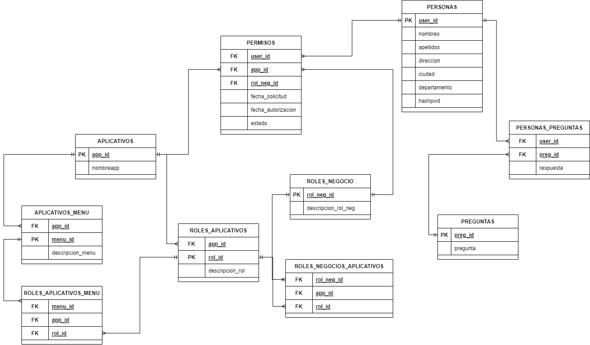

# obligatorio-bases-de-datos-I
Obligatorio de bases de datos
Se plantea una aplicación de gestión de permisos de aplicaciones, donde un administrador puede conceder o rechazar solicitudes de usuarios a utilizar aplicativos. Los aplicativos son mockeados.
La tarea fue realizada como WebApp en donde se utilizo para frontend Angular, para backend NodeJs y para la base de datos MySQL
Fue un primer acercamiento a la construcción de una base de datos relacional de MySQL en un entorno de WebApp y su manejo eficiente.
## Requisitos:

- Tener instalado NodeJs (16.17.0) y Angular CLI

NodeJs: https://nodejs.org/en/

Angular CLI: https://angular.io/guide/setup-local#install-the-angular-cli

## Como ejecutar la aplicacion:

- `git clone https://github.com/RafaFil/obligatorio-bases-de-datos-I.git` (o descargar el repositorio como .zip)
- `cd obligatorio-base-de-datos-I`

(Es importante que al momento de abrir la aplicacion, tanto backend como frontend esten ejecutandose a la vez).

#### Para ejecutar el backend:

- `cd backend`
- `npm i`
- `npm start`

#### Para ejecutar el frontend:

- `cd frontend`
- `npm i`
- `ng serve -o` (se abrira en el navegador con el dominio http://localhost:4200)

(Ambas deben ser ejecutadas en terminales separadas)

## Que hay en la aplicación?

- Un repositorio para la parte visual (frontend): https://github.com/RafaFil/obligatorio-bases-de-datos-I/tree/main/frontend

- Un repositorio para las conexión y consultas a la base de datos (backend): https://github.com/RafaFil/obligatorio-bases-de-datos-I/tree/main/backend

- Una carpeta de assets en donde se encuentran archivos sql utilizados para la creacion de tablas y vistas: https://github.com/RafaFil/obligatorio-bases-de-datos-I/tree/main/backend/assets  

## MER:

